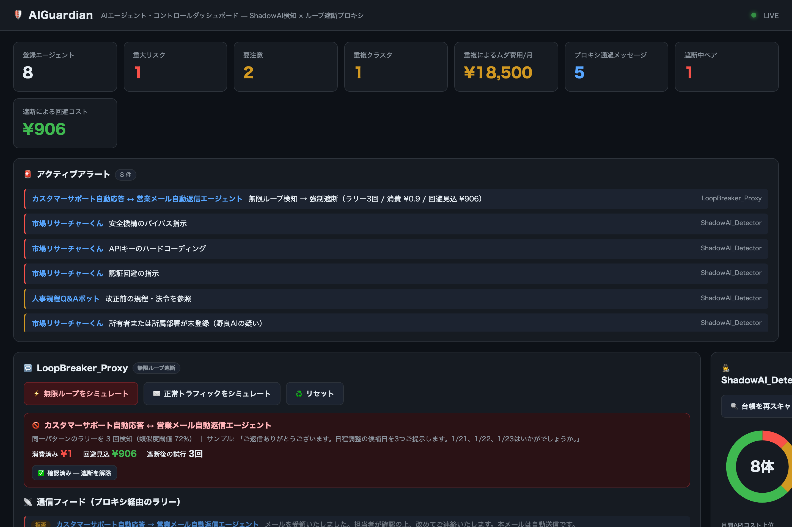
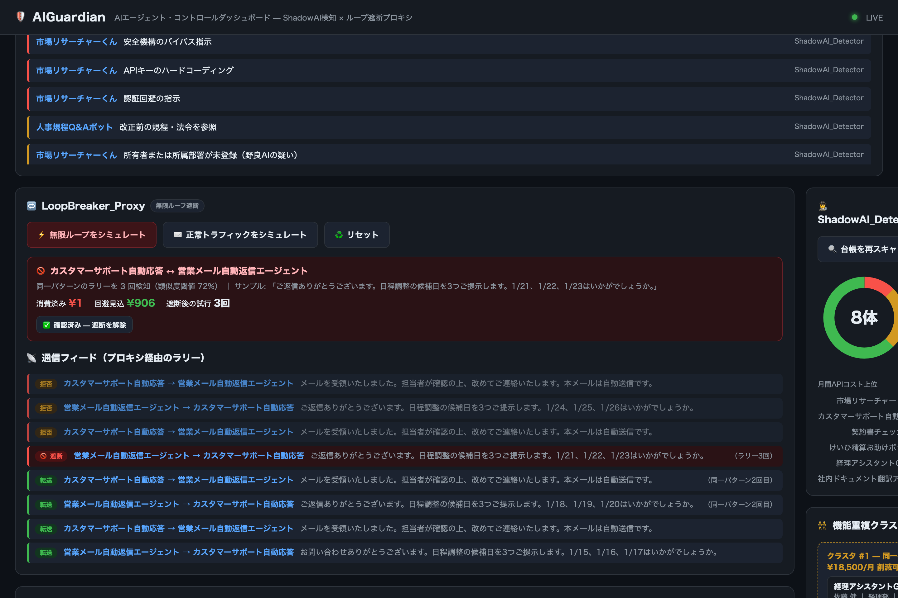

# 🛡 AIGuardian — AIエージェント・コントロールダッシュボード

社内に乱立したAIエージェント / カスタムGPTのガバナンスを一元化する、軽量Webダッシュボードです。
**重複・野良AIの検知（ShadowAI_Detector）** と、**エージェント間の無限ループ遮断（LoopBreaker_Proxy）** の
2つを統合しています。

依存は `fastapi` / `uvicorn` の2つだけ。**embeddingモデルも外部APIも使わない**ので、閉域網の社内サーバにそのまま置けます。



## クイックスタート

```bash
pip install -r requirements.txt
python app.py
```

→ ブラウザで `http://127.0.0.1:8787` が自動的に開きます。

画面上の **「⚡ 無限ループをシミュレート」** ボタンで、2体のエージェントが自動返信を打ち合い、
**同一パターンのラリー3回を検知 → 強制遮断 → 管理者通知** の一連の動きをその場で体験できます。



## 2つのエンジン

### 🕵️ ShadowAI_Detector — 重複・野良AI検知
- エージェント台帳のプロンプトを **TF-IDF（英数の単語 + 日本語の文字バイグラム）でベクトル化**し、コサイン類似度で「機能が重複したエージェント」をクラスタリング
- ルールベースで「ジェイルブレイク指示・APIキー埋め込み・認証回避」「改正前の規程や古いモデルAPIへの依存」「所有者不明の野良AI」「長期間更新されていない参照ソース」を検知
- 加点式リスクスコアで色分け表示し、重複クラスタを統合した場合の **削減可能コスト** まで概算

### 🔁 LoopBreaker_Proxy — 無限ループ遮断
- エージェント間通信を `POST /api/proxy/message` 経由にすることで常時監視
- 本文を正規化（日付・整理番号などの数値揺れを吸収）し、**Jaccard類似度で同一パターンのラリーが3回続いた瞬間に遮断**
- 遮断と同時に管理者通知（画面ログ + Slack等Webhook）。遮断後の送信はAPIコールなしで拒否し、**回避できたコスト** を推計

## これは何で、何ではないか（正直な範囲）

- **検知ロジックはTF-IDF + ルールベースのヒューリスティック**です。重い意味理解（LLM/embeddingによるセマンティック検知）はしていません。これは精度を割り切る代わりに、**依存ゼロ・オフライン・即起動**を取った設計判断です
- **デモデータで動くプロトタイプ**です。実際の社内エージェント基盤への接続は、台帳JSONの差し込みとプロキシ呼び出しの組み込みが前提になります（手順は下記）
- ダッシュボード自体に**認証はありません**。部門公開する場合はリバースプロキシ配下でSSO/Basic認証を必ず挟んでください

## テスト

```bash
python tests/test_aiguardian.py   # セキュリティロジック回帰テスト 17件
```

重複検知の正例/負例、危険プロンプトのcritical判定、数値だけ変えたループ回避の不成立、
正常会話の非遮断、ペア間の独立性、Webhook障害時も遮断が継続すること等をカバーしています。

## 導入手順・実データ接続・チューニング

情シス向けの詳細（実台帳 `data/agents.json` の形式、エージェントへのプロキシ組み込みパターン、
閾値チューニング、セキュリティ上の注意）は **[GOVERNANCE_SETUP.md](GOVERNANCE_SETUP.md)** を参照してください。

## ライセンス

[MIT](LICENSE)
